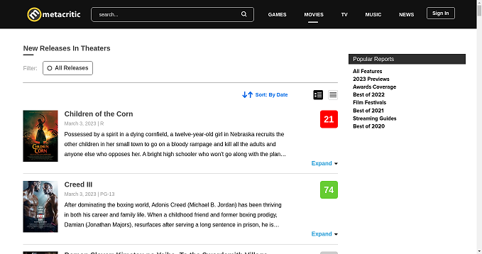

# Robocat base docker image


This is the base docker image that bundles [TagUI](https://aisingapore.org/aiproducts/tagui/) together with [Xvfb](https://en.wikipedia.org/wiki/Xvfb), [fluxbox](https://en.wikipedia.org/wiki/Fluxbox), [x11vnc](https://en.wikipedia.org/wiki/X11vnc), [Google Chrome](https://en.wikipedia.org/wiki/Google_Chrome), and [some other dependencies](#full-list-of-installed-dependencies) in a neat package, so it is possible to run TagUI flows in a container.

## Usage

First, launch start the container with the following command while in the current repository:

```bash
docker run --rm -it --name robocat -v $(pwd)/examples:/flow ghcr.io/robocat-ai/robocat-base
```

> NOTE: Notice `-v` flag which mounts the path `<current working directory>/examples` to `/flow` inside the container.
> Internally, `run` command copies your flow data from `/flow` to `/home/robocat/flow` so your mounted directory is not modified during flow execution.

Next, run `google.tag` from `examples` directory:

```bash
docker exec -it robocat run google
```

You will see TagUI logging its progress. After it finishes, you can see the result by copying it from inside the container:

```bash
docker cp robocat:/home/robocat/flow/top_result.png .
```



## Full list of installed dependencies

- [Amazon Corretto 8 (1.8.0)](https://docs.aws.amazon.com/corretto/latest/corretto-8-ug/what-is-corretto-8.html)
- [PHP 8.1](https://www.php.net/releases/8.1/en.php)
- [Tesseract OCR 4.1](https://github.com/tesseract-ocr/tesseract/tree/4.1#about)
- [tinyproxy](https://tinyproxy.github.io)
